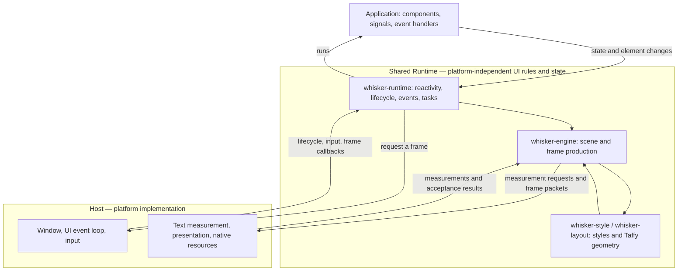

# Whisker architecture

Whisker is a UI framework for writing applications in Rust. Its **shared
Runtime** executes application code and determines the UI's structure, styles,
and layout. A **Host** connects that Runtime to a particular platform: it owns
the window and event loop, measures platform content, and draws the UI.

**Runtime and Host are separated by responsibility, not by language or thread.**
The Web and Desktop Hosts are also written in Rust. On each platform, the Host
calls into the Runtime on its UI thread, and the Runtime calls back into Host
services when it needs measurement or presentation.

This document explains that division, follows an update through the system,
and points to the code that owns each part. For building and running an
example, start with [CONTRIBUTING.md](../CONTRIBUTING.md).

## The Runtime–Host boundary

Here, **Runtime** means the shared execution and UI implementation, including
`whisker-runtime`, `whisker-engine`, `whisker-style`, and `whisker-layout`.
The crate named `whisker-runtime` supplies reactivity and orchestration; it
delegates scene management and layout to the other crates inside this boundary.

### Who decides what

| Concern | Shared Runtime | Host |
|---|---|---|
| Application state | Owns signals, effects, component scopes, and Rust event handlers | Delivers external events to the mounted instance |
| UI structure | Decides which elements exist, their hierarchy, and their properties | Creates the platform objects needed to represent those elements |
| Layout | Resolves styles and computes box sizes and positions with Taffy | Supplies viewport metrics and intrinsic content measurements; applies the computed geometry |
| Text | Supplies text, resolved text style, and measurement constraints | Shapes and measures text using its font system, then draws it |
| Frames | Tracks pending work, advances shared animations, and produces frame packets | Owns the clock and event loop; schedules callbacks and presents accepted frames |
| Input | Routes shared events and runs application callbacks | Receives OS/browser input and translates it into the shared model |
| Scrolling | Owns scroll content layout, List virtualization, and application scroll commands | Executes scrolling, including platform physics, and reports the actual offset |
| Native services | Dispatches module calls and delivers results to application code | Implements the service and owns its native objects and resources |

For example, the Host answers “how large is this text under these constraints?”
The Runtime uses that answer to decide where the text and its siblings belong.
The Host then draws those boxes. Measuring a leaf is a Host responsibility;
laying out the application tree is a Runtime responsibility.

### What crosses the boundary

| Initiator → receiver | Request | Result or later notification |
|---|---|---|
| Host → Runtime | Mount, pause, resume, unmount, or deliver input | Runtime lifecycle and application state are updated |
| Host → Runtime | `RuntimeInstance::drive_frame` with time and viewport metrics | Frame work completes; the Runtime indicates whether more work is needed |
| Runtime → Host | `RuntimeWakeHandle::wake` | The Host schedules a UI callback; this does not execute a frame on the caller's thread |
| Runtime → Host | `MeasurementProvider::measure_batch` | Measurements, or deferred completion through `measurement_ready` |
| Runtime → Host | `FrameSink::present` with a `FramePacket` | Acceptance, a snapshot request, or an error |
| Runtime → Host | A module function call or element command | A return value, async completion, or subsequent module/element event |

`MeasurementProvider` and `FrameSink` are interfaces defined by the shared
crates and implemented by Hosts. Their location in `whisker-engine` describes
what the Runtime needs; the platform implementation performs the actual work.

During `drive_frame`, the Runtime can call the Host's measurement and
presentation interfaces before returning to the Host event loop. These are
cooperating parts of one application, not separate processes or dedicated
threads. The Host owns the mounted Runtime's lifetime and initiates lifecycle
transitions; the Runtime implements what those transitions do to UI state.

Android and iOS carry these interactions through the mobile FFI Driver.
Web and Desktop use Rust calls directly. The Driver adapts the boundary; it
does not take over layout, scheduling policy, or platform drawing.

### Shared UI terms

A few terms recur throughout the implementation:

- **Retained** means that state survives between frames. The engine keeps the
  element descriptions and layout tree; it updates them when something changes.
- A **surface** is one UI tree with a viewport and a destination for its frames.
  The viewport supplies the available width, height, and display scale.
- A **frame packet** describes changes the Host should apply, such as creating
  an element, moving a box, changing text, or releasing a resource. It contains
  semantic operations, not a screenshot or a list of GPU instructions.

There is no virtual-DOM comparison of a freshly rendered application tree on
every update. Reactive dependencies identify which expressions need to run;
the engine collects the resulting element changes for presentation.

## From a tap to an updated screen

Consider a button that increments a signal displayed by a `Text` element.

1. **The Host receives input.** It translates platform input into the shared
   event model. The runtime resolves the target and invokes the Rust handler.
2. **The handler changes the signal.** Expressions that read that signal become
   eligible to run again. The runtime's wake handle asks the Host to schedule
   work on its UI event loop.
3. **The runtime applies reactive updates.** During a frame callback it advances
   animations, runs ready tasks, and flushes reactive work. A text binding emits
   a text change; it does not rebuild the entire application.
4. **The engine updates layout where needed.** A text change may affect its
   size. The layout layer calculates boxes, asking the Host for intrinsic
   measurements when necessary. Changes that affect only paint need not trigger
   a new box-layout calculation.
5. **The Host applies the frame.** The engine sends the resulting changes to the
   Host, which updates its retained views, DOM nodes, or drawing data. The engine
   advances its accepted frame revision after the Host accepts the packet.

Input handlers can flush some work during event delivery as well. The frame
callback is where ready work, layout, and presentation are brought together;
it is not the only entry point into the runtime.

An initial mount needs a full scene snapshot. Later frames usually contain
only changes. If the Host cannot apply a delta to its current revision, it can
request a new snapshot. Revision tracking keeps the producer and receiver from
silently continuing with different trees.

## Layout and drawing are separate jobs

[`whisker-style`](../crates/whisker-style/src/lib.rs) defines the shared style
values. [`whisker-layout`](../crates/whisker-layout/src/lib.rs) translates layout
inputs into a retained [Taffy](../crates/whisker-layout/Cargo.toml) tree and
calculates element sizes and positions. The tree has an internal root sized to
the viewport, so the application's root participates in ordinary flex layout.

Layout uses logical pixels or points. The Host handles conversion to physical
pixels and the platform's drawing APIs. Even on Web, Rust calculates the box
geometry; the browser Host positions DOM nodes using those results.

Some sizes depend on platform content. For example, Rust can constrain a text
box to a particular width, but the Host knows how its fonts shape and wrap the
text. The engine batches these measurement requests through
[`MeasurementProvider`](../crates/whisker-engine/src/layout.rs), validates the
responses, and continues layout. Measurement results can be reused while their
inputs remain valid; deferred results can request another frame when ready.

[`FrameSink`](../crates/whisker-engine/src/recording.rs) is the other main
Rust-facing boundary: it receives a complete frame packet for presentation.
The shared [`whisker-protocol`](../crates/whisker-protocol/src/lib.rs) defines
frame, measurement, input, resource, and capability types. Platform drawing
objects and Taffy's internal types do not become part of that contract.

This separation lets the platforms share layout rules while using their own
text and rendering systems. It does not promise identical font rasterization
or native scroll physics across platforms.

## State, ownership, and threads

UI state exists on both sides of the boundary. The Host retains a platform
representation of the scene, not the application's reactive state:

| Structure | Owner | Purpose |
|---|---|---|
| Reactive owner tree | Runtime (`whisker-runtime`) | Owns signals, effects, and cleanup; determines their lifetime |
| Element tree and scene | Runtime (`whisker-runtime` and `whisker-engine`) | Retains UI hierarchy, properties, styles, and event targets |
| Layout tree | Runtime (`whisker-layout`) | Retains box constraints, cached calculations, and geometry |
| Presentation state | Host | Retains native views, DOM nodes, drawing data, and resources for the accepted scene |

An `Element` is a small handle into the current runtime, not an owned native
view. Likewise, copying a signal handle does not extend the life of its owner.
When an owner is disposed, code must no longer read its signals. Pausing an
owner is different: it retains state for later resumption, which the router
uses for off-screen navigation entries. See [reactivity-design.md](reactivity-design.md)
for the lifetime and scheduling rules.

The implementation separates three responsibilities inside the runtime:

- [`RuntimeContext`](../crates/whisker-runtime/src/runtime_context.rs) contains
  the instance's reactive, task, and other runtime-local state. Entering it
  makes that state available to the APIs running on the UI thread.
- [`RuntimeInstance`](../crates/whisker-runtime/src/runtime_instance.rs) implements
  mounting, pausing, resuming, unmounting, event delivery, and frame driving
  when called by the Host.
- [`SurfaceRuntime`](../crates/whisker-runtime/src/surface_runtime.rs) connects
  element operations to the retained scene and layout engine.

UI code runs on a Host-owned UI thread. Local async tasks are polled there;
waking a task from another thread requests a UI callback rather than polling
UI code on the worker. Blocking work runs separately and returns its result to
the UI task. A `RuntimeDispatcher` provides an instance-specific way to post
work back to that thread.

Thread placement alone is not enough to call a native module. Module dispatch
also needs the active runtime's module Host binding. Worker code must not
assume it can use signals or native module APIs just because it has copied a
handle. The relevant boundaries are in
[`tasks.rs`](../crates/whisker-runtime/src/tasks.rs),
[`dispatch.rs`](../crates/whisker-runtime/src/dispatch.rs), and
[`module`](../crates/whisker-runtime/src/module.rs).

## What each Host implements

All Hosts implement the shared measurement, presentation, and input contracts.
They differ in how they connect to the operating system or browser.

| Host | Runtime connection | Platform work |
|---|---|---|
| [Android](../platforms/android/runtime/) | Kotlin/JNI and the mobile FFI Driver | Android views, frame callbacks, text measurement, drawing, and native modules |
| [iOS](../platforms/ios/) | Swift and the mobile FFI Driver | UIKit views, frame callbacks, text measurement, drawing, and native modules |
| [Web](../platforms/web/src/lib.rs) | Direct Rust calls from WebAssembly | DOM presentation, browser measurement and input, `requestAnimationFrame` scheduling |
| [Desktop](../platforms/desktop/src/lib.rs) | Direct Rust calls | A shared `winit` window/event loop, `cosmic-text` measurement, and `wgpu` drawing |

The macOS, Windows, and Linux target crates sit above the common Desktop Host.
They provide OS-named entry points and a place for platform-specific integration;
the common renderer lives in `platforms/desktop`.

Android and iOS need a foreign-function interface because their launch shells
are written in Kotlin and Swift:

- [`whisker-driver-sys`](../crates/whisker-driver-sys/src/lib.rs) defines the raw
  mobile ABI: C-compatible values, callbacks, and entry points. Host declarations
  are generated from this definition and checked for drift.
- [`whisker-driver`](../crates/whisker-driver/src/lib.rs) owns the opaque runtime
  handle, translates borrowed values, and adapts callbacks to the Rust runtime.

Web and Desktop do not pass through this mobile ABI. They instantiate the
runtime directly and supply Rust implementations of the same Host boundaries.

### Scrolling, lists, and platform modules

A `ScrollView` makes the boundary especially visible. The Runtime lays out its
viewport and content. During a gesture, the Host moves the content and reports
the current offset back to the Runtime; an application `scroll_to` request
travels in the opposite direction as a command. The Runtime uses reported
offsets for input routing and List reconciliation. This transient presentation
state is why a scroll is not a new flex-layout pass for every finger movement.

`List` builds on that `ScrollView` in Rust. It chooses the keyed item subtrees
to mount, keeps track of item extents, and uses spacers for unmounted ranges.
The Host receives ordinary elements; there is no separate native List protocol.
See [list-design.md](list-design.md) for virtualization and scroll reconciliation.

The crates under [`packages/`](../packages/) provide routing, animation,
widgets, and platform services on top of the public framework API. A module
can expose native functions, events, or an element such as an image or media
view. Its platform implementation supplies the native behavior while the shared
scene controls its place in the UI. Start with
[module-api-design.md](module-api-design.md) when adding a module.

## How an application is built and reloaded

Application code lives in `src/`; `whisker.rs` describes app metadata and build
configuration. **Continuous Native Generation (CNG)** turns that configuration
and registered build plugins into platform projects under `gen/<platform>/`.
Generated mobile projects compose the application with the Android or iOS Host
SDK instead of containing a copy of the Host implementation.

`whisker.rs` is registered as a `[[bin]]` target in the application's own Cargo
package and calls `whisker_config::run` from `main`. This gives rust-analyzer the
application's dependency graph for completion and navigation, including plugins
added with `cargo add`. The target requires the non-default `whisker-config`
feature, so ordinary builds omit the configuration executable.

The CLI evaluates configuration in `target/.whisker/config-probe`, a generated
Cargo package with `whisker-config` and discovered plugin dependencies. For a
Cargo-registered configuration binary, the probe uses `whisker.rs` directly as
its binary source. Otherwise it adapts the legacy `configure(&mut Config)` entry
point. Both emit the same JSON. The probe avoids building the application library,
which Cargo would also compile when running a binary in the application's own
package. It does not inherit arbitrary application dependencies or features;
configuration code uses `whisker-config`, the standard library, and plugin APIs
available with plugin default features disabled. `target/.whisker/` is disposable
build output and is not committed.

The tooling has a different lifetime from the shipped UI runtime:

| Tooling crate | Responsibility |
|---|---|
| [`whisker-cli`](../crates/whisker-cli/) | Reads configuration and selects the command and target |
| [`whisker-config`](../crates/whisker-config/) | Defines the configuration consumed by generation and builds |
| [`whisker-cng`](../crates/whisker-cng/) and [`whisker-plugin`](../crates/whisker-plugin/) | Generate platform projects and incorporate module build requirements |
| [`whisker-build`](../crates/whisker-build/) | Compiles and packages application artifacts with the target toolchain |
| [`whisker-dev-server`](../crates/whisker-dev-server/) | Coordinates the native development session, watching, patch delivery, and reload commands |

`whisker run` generates the target project, builds and launches it, then watches
for changes. Hot Reload compiles eligible Rust edits into patches and applies
them to the running process. The native patch path uses `whisker-subsecond`;
Web uses WebAssembly side modules. Development support is feature-gated and is
not needed by the release application.

Hot Reload and Full Reload are distinct operations. In the native development
loop, dependency changes or an unavailable patch path prompt for an explicit
Full Reload (`R`), which rebuilds and relaunches the app. A patch may also remount
components, so preserving the process does not guarantee that all component
state survives. Native hot patching supports Android, macOS, and the iOS
Simulator; iOS hardware has additional code-loading restrictions. Details and
platform differences belong in [hot-reload-internals.md](hot-reload-internals.md).

## Where to start when changing the framework

| Change | Start here |
|---|---|
| Element builders, `render!`, or `css!` authoring | [`whisker`](../crates/whisker/src/lib.rs), [`whisker-macros`](../crates/whisker-macros/), [`whisker-css`](../crates/whisker-css/) |
| Reactive dependencies or component lifetime | [`whisker-runtime/src/reactive`](../crates/whisker-runtime/src/reactive/) |
| Scheduling, lifecycle, input, or module dispatch | [`whisker-runtime`](../crates/whisker-runtime/src/lib.rs) |
| Style semantics | [`whisker-style`](../crates/whisker-style/src/lib.rs) |
| Box layout and layout invalidation | [`whisker-layout`](../crates/whisker-layout/src/lib.rs) |
| Scene changes, measurement coordination, or frame production | [`whisker-engine`](../crates/whisker-engine/src/lib.rs) |
| A shared Host contract | [`whisker-protocol`](../crates/whisker-protocol/src/lib.rs), then the affected Hosts |
| Mobile ABI conversion | [`whisker-driver`](../crates/whisker-driver/src/lib.rs) and [`whisker-driver-sys`](../crates/whisker-driver-sys/src/lib.rs) |
| A platform's visible behavior | Its implementation under [`platforms/`](../platforms/) |
| Application-facing modules or widgets | [`packages/`](../packages/) |

Core tests can exercise the runtime and engine with a Rust-only recording Host.
[Host conformance scenarios](../tests/host-conformance/README.md) exercise the
platform side with shared frame and input fixtures. Full-stack tests then check
that the two sides work together. A layout calculation, a correct frame packet,
and correct pixels on a device are separate things to verify.

For focused explanations, continue with [reactivity](reactivity-design.md),
[lists](list-design.md), [routing](router-design.md), or
[animation](animation-design.md). These documents describe the current design;
issues, PRs, and Git history preserve the discussions behind it.
